# Open-Meteo Weather Analytics Pipeline

**AICA Capstone Project – Data Engineering Track (2025/2026 Cohort 2)**

## Project Overview

This project implements a **maintainable weather data engineering pipeline** using the **Open-Meteo Weather API**, **Python**, **PostgreSQL**, **star schema modelling**, **pytest**, and **Apache Airflow**.

The solution was built to satisfy the AICA Capstone requirement of delivering a **production-style ETL and ELT weather analytics pipeline** that can be understood, maintained, tested, and automated by another data engineering team.

The project includes:

* A fully modular **ETL pipeline**
* A fully modular **ELT workflow** with a staging layer
* **Data validation and cleaning**
* **Star schema design** for analytics
* **PostgreSQL loading logic**
* **Apache Airflow DAGs** for automation
* **Unit and integration tests**
* **Logging and error handling**
* **Project documentation and evidence screenshots**

---

# Table of Contents

1. [Project Objective](#project-objective)
2. [Business Scenario](#business-scenario)
3. [Architecture Overview](#architecture-overview)
4. [Project Features](#project-features)
5. [Technology Stack](#technology-stack)
6. [Project Structure](#project-structure)
7. [Dataset and API Source](#dataset-and-api-source)
8. [Pipeline Design](#pipeline-design)

   * [ETL Pipeline](#etl-pipeline)
   * [ELT Pipeline](#elt-pipeline)
9. [Star Schema Design](#star-schema-design)

   * [Staging Table](#staging-table)
   * [Dimension Tables](#dimension-tables)
   * [Fact Table](#fact-table)
10. [Data Validation Rules](#data-validation-rules)
11. [How the ETL Pipeline Works](#how-the-etl-pipeline-works)
12. [How the ELT Pipeline Works](#how-the-elt-pipeline-works)
13. [Airflow Automation](#airflow-automation)
14. [Setup Instructions](#setup-instructions)
15. [How to Run the Project](#how-to-run-the-project)
16. [How to Run Tests](#how-to-run-tests)
17. [Screenshots / Evidence](#screenshots--evidence)
18. [Sample Database Outputs](#sample-database-outputs)
19. [Key Design Decisions](#key-design-decisions)
20. [Error Handling and Logging](#error-handling-and-logging)
21. [Testing Strategy](#testing-strategy)
22. [Limitations and Future Improvements](#limitations-and-future-improvements)
23. [Conclusion](#conclusion)

---

# Project Objective

The goal of this project is to build a **maintainable weather analytics pipeline** that:

1. Extracts weather forecast data from the **Open-Meteo API**
2. Validates and transforms the data
3. Loads it into a **PostgreSQL data warehouse**
4. Stores the analytical data in a **star schema**
5. Supports both **ETL** and **ELT** patterns
6. Runs automatically using **Apache Airflow**
7. Demonstrates clean software engineering and data engineering practices

This project was designed as a capstone submission for the **AICA Data Engineering Track**.

---

# Business Scenario

A weather analytics company collects weather data from external APIs to support:

* weather reporting
* business forecasting
* climate monitoring
* downstream analytics and dashboards

The company needs a maintainable pipeline that can:

* retrieve weather data from an external API
* validate the incoming payload
* store clean analytical data in a warehouse
* keep a raw staging layer for ELT processing
* run automatically every day

This project simulates that requirement.

---

# Architecture Overview

The project implements **two parallel pipeline patterns**:

## 1. ETL Pipeline

**Extract → Transform → Load**

* Extract weather data from the API
* Transform and validate it in Python
* Load clean data into dimension and fact tables

## 2. ELT Pipeline

**Extract → Load raw to staging → Transform → Load to warehouse**

* Extract weather data from the API
* Load the raw JSON payload into a staging table
* Read unprocessed staging records
* Transform them into star-schema tables
* Load the transformed output into the warehouse
* Mark staging rows as processed

---

# Project Features

This project includes the following features:

* API extraction from **Open-Meteo**
* Modular **class-based pipeline design**
* ETL and ELT implementations
* PostgreSQL loading with **upsert / conflict handling**
* **Star schema** warehouse design
* Raw API **staging layer** for ELT
* **Validation layer** for weather data quality checks
* **Logging** for pipeline execution and failures
* **Pytest unit and integration tests**
* **Apache Airflow DAGs** for automation
* Documentation screenshots for evidence and reproducibility

---

# Technology Stack

| Component           | Tool / Library           |
| ------------------- | ------------------------ |
| Language            | Python 3.10              |
| API Requests        | `requests`               |
| Data Processing     | `pandas`                 |
| Database            | PostgreSQL               |
| DB Access           | SQLAlchemy + psycopg2    |
| Validation          | Custom validation layer  |
| Workflow Automation | Apache Airflow           |
| Testing             | pytest                   |
| Configuration       | `.env` + `python-dotenv` |
| Logging             | Python logging module    |
| Schema Design       | SQL star schema          |

---

# Project Structure

```bash
open-meteo-project/
├── README.md
├── dags/
│   ├── weather_elt_pipeline.py
│   └── weather_etl_pipeline.py
├── docs/
│   └── images/
│       ├── airflow_dashboard.png
│       ├── airflow_elt_dag_success.png
│       ├── airflow_elt_graph_view.png
│       ├── airflow_etl_dag_success.png
│       ├── airflow_etl_graph_view.png
│       ├── dim_date.png
│       ├── dim_location.png
│       ├── fact_table.png
│       ├── pytest_outcome.png
│       ├── staging_raw_payload_output.png
│       ├── star_schema_join_output.png
│       ├── star_schema_join_query.png
│       └── stg_weather_raw.png
├── logs/
│   └── pipeline.log
├── main_elt.py
├── main_etl.py
├── requirements.txt
├── sql/
│   └── schema.sql
├── src/
│   ├── elt/
│   │   ├── elt_transformer.py
│   │   └── staging_loader.py
│   ├── extract/
│   │   └── api_extractor.py
│   ├── load/
│   │   └── db_loader.py
│   ├── pipeline/
│   │   ├── weather_elt_pipeline.py
│   │   └── weather_etl_pipeline.py
│   ├── transform/
│   │   └── transformer.py
│   ├── utils/
│   │   ├── config.py
│   │   └── logger.py
│   └── validation/
│       └── validator.py
└── tests/
    ├── test_extractor.py
    ├── test_loader.py
    ├── test_pipeline_integration.py
    ├── test_staging_loader.py
    ├── test_transformer.py
    └── test_validator.py
```

---

# Dataset and API Source

## Open-Meteo Weather API

This project uses the **Open-Meteo Weather API**.

* API Homepage: https://open-meteo.com/
* API Docs: https://open-meteo.com/en/docs

## Location used in this project

The default location configured for this project is:

* **Location Name:** Abuja
* **Latitude:** 9.0765
* **Longitude:** 7.3986

## Weather fields collected

The pipeline extracts the following daily weather fields:

* `temperature_2m_max`
* `temperature_2m_min`
* `precipitation_sum`
* `wind_speed_10m_max`

---

# Pipeline Design

## ETL Pipeline

The ETL workflow transforms data **before** loading it into the warehouse.

### ETL Flow

1. Extract weather data from the API
2. Validate API structure
3. Convert raw JSON to a DataFrame
4. Clean, validate, and transform the data
5. Split transformed data into:

   * `dim_date`
   * `dim_location`
   * `fact_weather`
6. Load the tables into PostgreSQL

---

## ELT Pipeline

The ELT workflow loads raw API responses first, then transforms them later.

### ELT Flow

1. Extract weather data from the API
2. Load raw JSON payload into `stg_weather_raw`
3. Retrieve unprocessed staging records
4. Transform raw payloads into star-schema tables
5. Load transformed tables into PostgreSQL
6. Mark processed staging records as complete

---

# Star Schema Design

The warehouse uses a **star schema** for weather analytics.

---

## Staging Table

### `stg_weather_raw`

Stores raw API payloads before transformation.

| Column                 | Description                                             |
| ---------------------- | ------------------------------------------------------- |
| `staging_id`           | Surrogate key for staged API payload                    |
| `raw_payload`          | Raw API response stored as JSONB                        |
| `extraction_timestamp` | Time the raw payload was inserted                       |
| `processed`            | Boolean flag showing whether ELT processing is complete |

This table supports:

* auditability of raw API responses
* ELT reprocessing without calling the API again
* separation of raw ingestion from transformation logic

---

## Dimension Tables

## `dim_date`

Stores reusable calendar/date attributes.

| Column        | Description                           |
| ------------- | ------------------------------------- |
| `date_key`    | Integer date key in `YYYYMMDD` format |
| `date`        | Actual calendar date                  |
| `year`        | Year                                  |
| `month`       | Month                                 |
| `day`         | Day                                   |
| `day_of_week` | Day name                              |

---

## `dim_location`

Stores descriptive location attributes.

| Column          | Description                |
| --------------- | -------------------------- |
| `location_key`  | Surrogate location key     |
| `location_name` | Standardized location name |
| `latitude`      | Latitude                   |
| `longitude`     | Longitude                  |

---

## Fact Table

## `fact_weather`

Stores quantitative weather measurements.

| Column               | Description                         |
| -------------------- | ----------------------------------- |
| `weather_id`         | Surrogate fact key                  |
| `date_key`           | FK to `dim_date`                    |
| `location_key`       | FK to `dim_location`                |
| `temperature_2m_max` | Maximum daily temperature           |
| `temperature_2m_min` | Minimum daily temperature           |
| `precipitation_sum`  | Total daily precipitation           |
| `wind_speed_10m_max` | Maximum daily wind speed            |
| `temp_range`         | Derived field = max temp - min temp |
| `load_timestamp`     | ETL/ELT load timestamp              |

### Uniqueness rule

A unique constraint prevents duplicate weather records for the same location and date:

* `uq_weather_day_location (date_key, location_key)`

This makes the fact table idempotent and safe for repeated loads.

---

# Data Validation Rules

The project includes a dedicated validation layer in `src/validation/validator.py`.

## Validation checks implemented

### API-level validation

* API response must return status code `200`
* API response must be valid JSON
* API response must not be empty
* API response must contain the `daily` section

### Dataset-level validation

* Required columns must exist
* Missing values in critical fields are removed
* Duplicate daily weather records are removed
* Maximum temperature must be greater than or equal to minimum temperature
* Precipitation cannot be negative
* Wind speed cannot be negative

### Required columns

The project validates the presence of:

* `time`
* `temperature_2m_max`
* `temperature_2m_min`
* `precipitation_sum`
* `wind_speed_10m_max`

---

# How the ETL Pipeline Works

The ETL pipeline is orchestrated by the `ETLPipeline` class.

## ETL components

* **Extractor:** `src/extract/api_extractor.py`
* **Transformer:** `src/transform/transformer.py`
* **Loader:** `src/load/db_loader.py`
* **Pipeline orchestration:** `src/pipeline/weather_etl_pipeline.py`

## ETL execution steps

1. `WeatherExtractor.get_weather_data()` fetches the weather data from Open-Meteo
2. `WeatherTransformer.transform()`:

   * creates a DataFrame
   * cleans column names
   * converts types
   * validates the dataset
   * creates derived fields
   * prepares star-schema tables
3. `WeatherLoader.load()` loads:

   * `dim_date`
   * `dim_location`
   * `fact_weather`

## Run entry point

```bash
python main_etl.py
```

---

# How the ELT Pipeline Works

The ELT pipeline is orchestrated by the `ELTPipeline` class.

## ELT components

* **Extractor:** `src/extract/api_extractor.py`
* **Staging loader:** `src/elt/staging_loader.py`
* **ELT transformer:** `src/elt/elt_transformer.py`
* **Warehouse loader:** `src/load/db_loader.py`
* **Pipeline orchestration:** `src/pipeline/weather_elt_pipeline.py`

## ELT execution steps

1. Extract weather data from API
2. Insert raw payload into `stg_weather_raw`
3. Retrieve rows where `processed = FALSE`
4. Transform each raw payload using the same transformation logic used in ETL
5. Load transformed dimension and fact tables
6. Mark processed staging IDs as `TRUE`

## Run entry point

```bash
python main_elt.py
```

---

# Airflow Automation

The project includes Airflow DAGs for **both ETL and ELT pipelines**.

## DAGs included in this repository

* `dags/weather_etl_pipeline.py`
* `dags/weather_elt_pipeline.py`

## Important note about Airflow deployment

For execution in the local Airflow environment, the DAG files were also placed in the Airflow DAGs directory:

```bash
/home/ugo/airflow/dags/
```

The copies stored in this project repository are included for:

* submission
* documentation
* version control
* reproducibility

---

## ETL Airflow DAG

**DAG ID:** `weather_etl_pipeline`

### Tasks

1. `extract_task`
2. `transform_task`
3. `load_task`

### ETL DAG dependency flow

```text
extract_task >> transform_task >> load_task
```

---

## ELT Airflow DAG

**DAG ID:** `weather_elt_pipeline`

### Tasks

1. `extract_to_staging_task`
2. `transform_staging_task`
3. `load_warehouse_task`
4. `mark_processed_task`

### ELT DAG dependency flow

```text
extract_to_staging_task
    >> transform_staging_task
    >> load_warehouse_task
    >> mark_processed_task
```

---

## Airflow schedule

Both DAGs are configured to run **daily**.

---

# Setup Instructions

## 1. Clone the repository

```bash
git clone <your-repository-url>
cd open-meteo-project
```

## 2. Create and activate a virtual environment

```bash
python3 -m venv .venv
source .venv/bin/activate
```

## 3. Install dependencies

```bash
pip install -r requirements.txt
```

## 4. Create a `.env` file

Create a `.env` file in the project root using the structure below:

```env
API_BASE_URL=https://api.open-meteo.com/v1/forecast

LATITUDE=9.0765
LONGITUDE=7.3986
LOCATION_NAME=Abuja

DB_HOST=localhost
DB_PORT=5432
DB_NAME=weather_db
DB_USER=postgres
DB_PASSWORD=

WEATHER_FIELDS=temperature_2m_max,temperature_2m_min,precipitation_sum,wind_speed_10m_max
```

---

## 5. Create the PostgreSQL database

Create a PostgreSQL database named:

```sql
weather_db
```

Then run the schema file:

```bash
psql -U postgres -d weather_db -f sql/schema.sql
```

---

# How to Run the Project

## Run the ETL pipeline

```bash
python main_etl.py
```

## Run the ELT pipeline

```bash
python main_elt.py
```

---

# How to Run Tests

Run all tests with:

```bash
pytest -v
```

## Test coverage included

The project includes tests for:

* extractor logic
* transformer logic
* validation rules
* loader logic
* staging loader logic
* pipeline integration flow

### Current result

All tests passed successfully:

* **35 tests passed**

---

# Screenshots / Evidence

The project includes execution evidence and database screenshots in:

```bash
docs/images/
```

## Airflow screenshots

### Airflow Dashboard

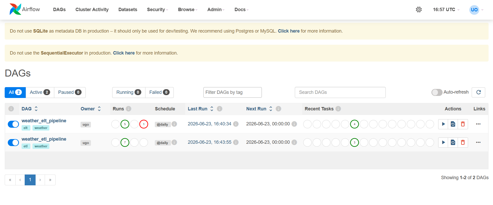

### ETL DAG – Successful Run

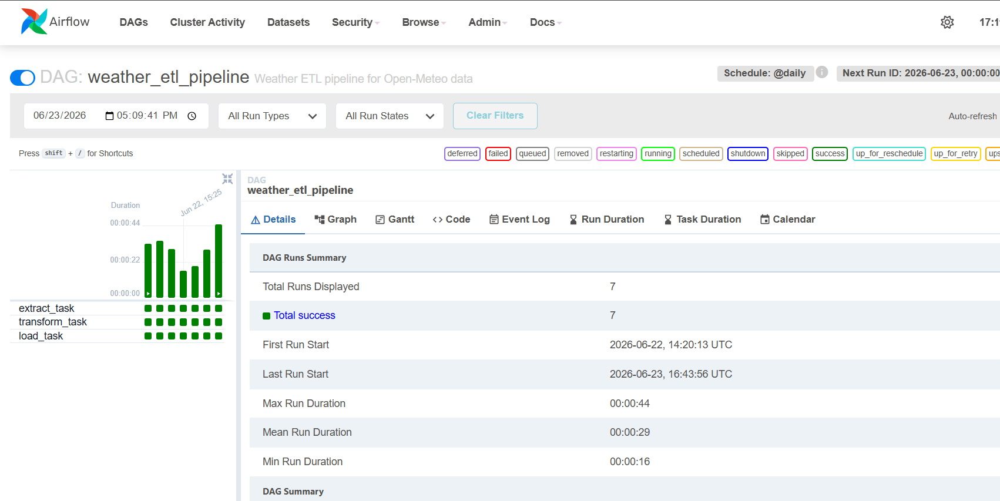

### ETL DAG – Graph View

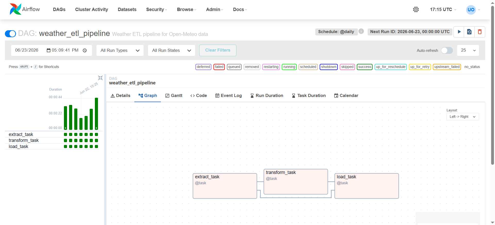

### ELT DAG – Successful Run

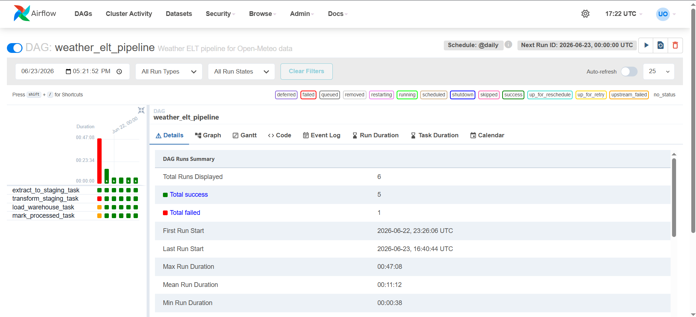

### ELT DAG – Graph View

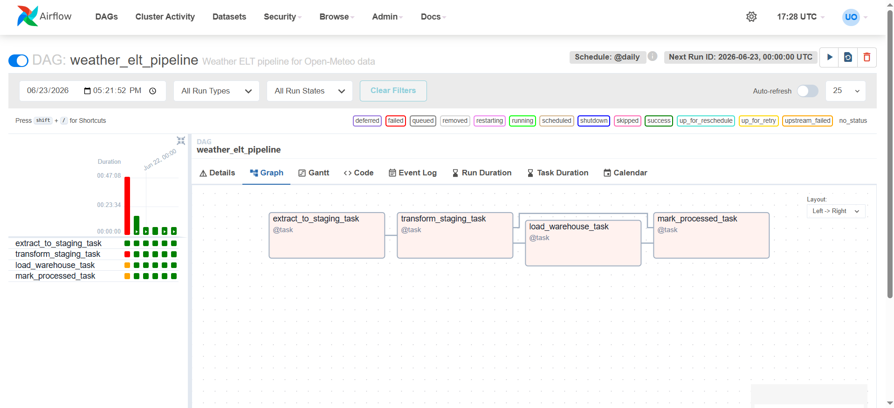

---

## Database output screenshots

### `dim_date`

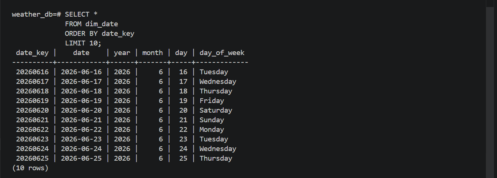

### `dim_location`

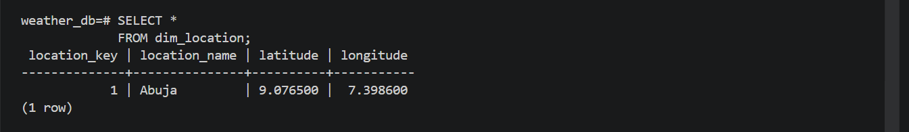

### `fact_weather`

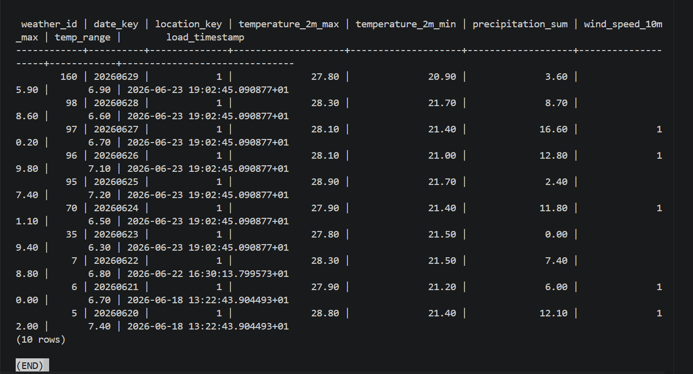

### `stg_weather_raw`

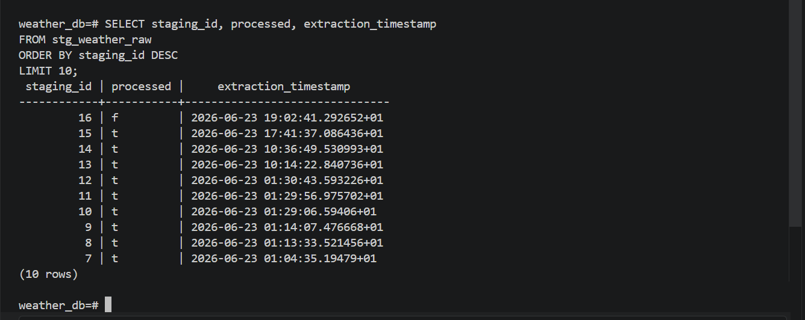

### Staging raw payload sample

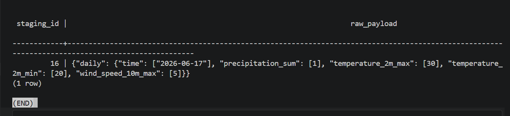

### Star schema join query

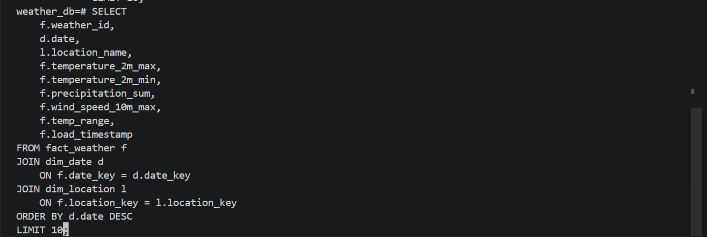

### Star schema join output

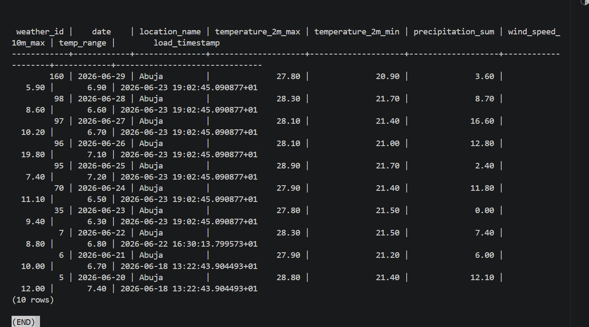

---

## Testing evidence

### Pytest execution

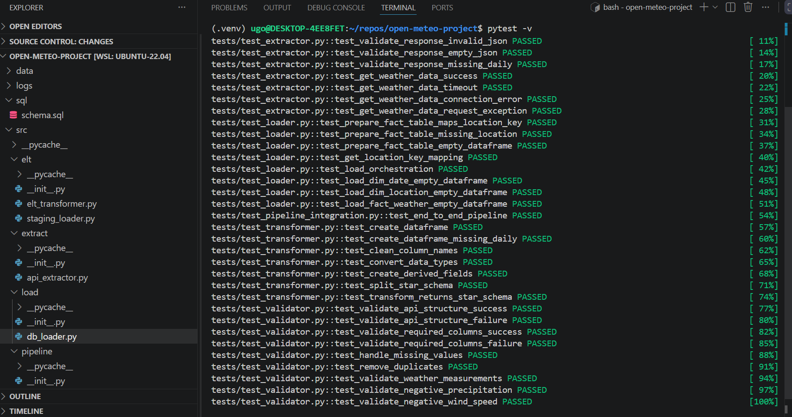

---

# Sample Database Outputs

## 1. Date dimension sample

A sample of the `dim_date` table was captured in:

* `docs/images/dim_date.png`

This table stores the date key and reusable date attributes for analytics.

---

## 2. Location dimension sample

A sample of the `dim_location` table was captured in:

* `docs/images/dim_location.png`

This table stores location metadata for the weather fact table.

---

## 3. Weather fact table sample

A sample of the `fact_weather` table was captured in:

* `docs/images/fact_table.png`

This table contains the analytical weather metrics and the derived `temp_range` field.

---

## 4. Staging layer sample

A sample of the raw staging payload was captured in:

* `docs/images/stg_weather_raw.png`
* `docs/images/staging_raw_payload_output.png`

These screenshots demonstrate the ELT staging layer storing raw API JSON before transformation.

---

## 5. Star schema join sample

A join query across `fact_weather`, `dim_date`, and `dim_location` was captured in:

* `docs/images/star_schema_join_query.png`
* `docs/images/star_schema_join_output.png`

This demonstrates how the star schema supports analytical querying.

---

# Key Design Decisions

## 1. Separate ETL and ELT implementations

The project intentionally includes both ETL and ELT workflows because the capstone required both patterns. This also demonstrates understanding of:

* pre-load transformation (ETL)
* post-load transformation with staging (ELT)

---

## 2. Reuse of transformation logic

The ELT pipeline reuses the same transformation logic used by the ETL pipeline. This reduces duplication and keeps business rules consistent across both workflows.

---

## 3. Staging layer for raw API auditability

The `stg_weather_raw` table allows:

* raw payload retention
* reprocessing without another API call
* clear separation between raw ingestion and analytical transformation

---

## 4. Star schema for analytics

The star schema was chosen because it is simple, maintainable, and well suited for analytical queries and reporting.

---

## 5. Idempotent warehouse loading

The fact table uses a unique constraint on `(date_key, location_key)` with an upsert strategy to avoid duplicate analytical records across repeated runs.

---

# Error Handling and Logging

The project uses **logging** and **exception handling** throughout the pipeline.

## Logging coverage includes:

* start and completion of extraction
* start and completion of transformation
* start and completion of database loads
* warnings for missing values or invalid records
* critical pipeline failures

## Error handling includes:

* API connection failures
* API timeout errors
* invalid API responses
* missing required columns
* invalid weather measurements
* database connection errors
* database loading failures
* staging processing failures

Logs are written to:

```bash
logs/pipeline.log
```

---

# Testing Strategy

The project includes **pytest-based unit and integration tests**.

## Test files included

* `tests/test_extractor.py`
* `tests/test_loader.py`
* `tests/test_pipeline_integration.py`
* `tests/test_staging_loader.py`
* `tests/test_transformer.py`
* `tests/test_validator.py`

## Areas tested

### Extractor tests

* parameter construction
* valid API response handling
* non-200 response handling
* invalid JSON handling
* timeout / connection exceptions

### Transformer tests

* DataFrame creation
* column cleaning
* type conversion
* derived fields
* star schema split

### Validator tests

* required column validation
* API structure validation
* missing value handling
* duplicate removal
* business rule validation

### Loader tests

* surrogate key resolution
* fact table preparation
* empty DataFrame handling
* orchestration logic

### Integration test

* end-to-end pipeline flow validation

---

# Limitations and Future Improvements

This project satisfies the capstone requirements, but several improvements could be made in a production environment.

## Possible future improvements

### 1. Support multiple locations

The current implementation uses a single configured location (Abuja). A production system could ingest weather data for multiple cities and countries.

### 2. Add historical weather ingestion

The current project focuses on forecast-style daily weather data. A future version could include historical weather ingestion and trend analysis.

### 3. Add data quality reporting

Validation results could be persisted into a dedicated data quality audit table rather than only being logged.

### 4. Containerise the project

Dockerising the project would make it easier to deploy consistently across machines.

### 5. Add CI/CD

A GitHub Actions workflow could automatically run tests and linting on every push.

### 6. Add warehouse documentation / ERD

A visual ERD or dbt-style documentation layer could improve discoverability for downstream users.

### 7. Add orchestration environment configuration

Airflow deployment details could be parameterised more cleanly for local vs production execution.

---

# Conclusion

This project demonstrates the design and implementation of a **maintainable weather analytics data pipeline** using modern data engineering practices.

It includes:

* a modular **ETL pipeline**
* a modular **ELT workflow with staging**
* **API extraction**
* **data validation**
* **star schema warehouse loading**
* **PostgreSQL integration**
* **Airflow orchestration**
* **logging, testing, and documentation**

The project was built with maintainability in mind and structured so that another engineer can understand, run, test, and extend it.

It serves as a practical capstone implementation of core data engineering concepts including:

* extraction from external APIs
* transformation and validation of analytical data
* relational warehouse design
* ETL vs ELT processing patterns
* orchestration with Airflow
* software engineering discipline in data projects

---

## Author

**Ugochukwu Obenwa**
AICA Data Engineering Capstone Project
